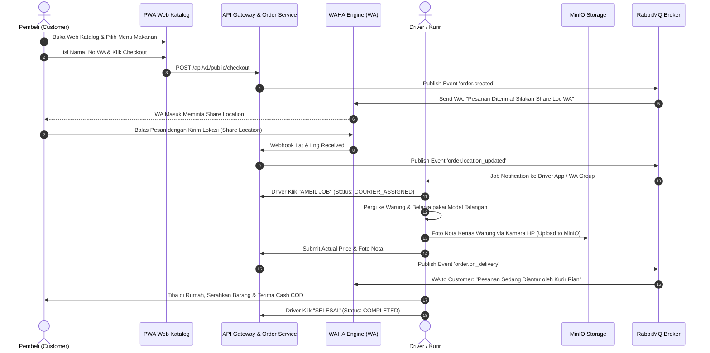

# DOKUMEN SPESIFIKASI PRODUK, PERAN PENGGUNA, DAN FLOW BISNIS (PRD & BUSINESS FLOW)

---

## 🎯 1. Target Market (Target Pasar)
Target pasar utama platform **Pesan Antar Desa** meliputi:
1. **Masyarakat Desa & Kota Kecil (Suburban/Rural):** Warga desa, ibu rumah tangga, pekerja desa, dan pemuda yang terbiasa menggunakan WhatsApp untuk komunikasi harian dan menginginkan kemudahan memesan makanan/sembako tanpa keluar rumah.
2. **Pemilik Warung & UMKM Desa:** Warung makan, toko sembako, dan pedagang jajanan lokal yang ingin menjangkau lebih banyak pembeli di seluruh desa tanpa harus mengelola armada kurir sendiri.
3. **Pemuda Desa (Calon Kurir):** Pemuda lokal yang membutuhkan lapangan kerja fleksibel dengan penghasilan harian dari jasa pengantaran.
4. **Pengelola Desa / BUMDes:** Pengelola ekonomi desa yang ingin memodernisasi perdagangan desa dan mendapatkan pendapatan asli desa (PADes).

---

## 👤 2. Pemakai Sistem & Peran Pengguna (User Roles)

### A. Pembeli (Customer / Warga Desa)
* **Karakteristik:** Menggunakan HP spesifikasi menengah-bawah, sensitif kuota internet, sudah sangat akrab dengan WhatsApp.
* **Tugas & Fitur:**
  * Membuka Web Katalog (PWA) tanpa perlu download aplikasi.
  * Mencari warung & menu makanan/sembako.
  * Memilih produk katalog & menambahkan request custom / titipan.
  * Mengirim Share Location di WhatsApp ke Chatbot WAHA.
  * Menerima notifikasi status pesanan & struk digital via WA.

### B. Driver / Kurir Lokal (Courier)
* **Karakteristik:** Pemuda desa pemilik sepeda motor, mengoperasikan smartphone Android.
* **Tugas & Fitur:**
  * Login di Driver Mobile App (React Native).
  * Mengubah status *Online / Offline*.
  * Mengklaim pesanan yang masuk (*Job Claim*).
  * Belanja barang di warung (memakai modal talangan pribadi / pinjaman kas admin).
  * Mengambil foto nota kertas warung dengan kamera HP $\rightarrow$ Upload ke MinIO.
  * Menyesuaikan total belanja asli di aplikasi.
  * Mengantar ke rumah pembeli & menerima uang tunai (COD).

### C. Admin Desa / Pengelola BUMDes (Platform Manager)
* **Karakteristik:** Pengelola BUMDes atau admin teknis desa yang mengoperasikan laptop/PC di kantor desa.
* **Tugas & Fitur:**
  * Menginput & mengelola data warung serta katalog produk.
  * Mendaftarkan & memverifikasi Driver resmi desa.
  * Meminjamkan modal kas pagi (`courier_loans`) ke Driver.
  * Memantau seluruh arus pesanan & audit log transaksi.
  * Melihat grafik analitis (Warung terlaris, rute teramai, jam sibuk).

### D. Pemilik Warung / Merchant (Mitra Phase 2)
* **Karakteristik:** Pemilik toko lokal yang memantau pesanan masuk dan mengonfirmasi ketersediaan barang.

---

## 💡 3. Konsep Sistem & Gambaran Umum

Sistem ini mengusung konsep **Hybrid Web-to-WhatsApp Micro-Logistics**:
1. **Zero Friction Adoption:** Pembeli tidak dipaksa mengunduh aplikasi di Play Store. Mereka cukup membuka link PWA ringkas.
2. **Automated WhatsApp Integration (WAHA Engine):** Seluruh titik krusial (konfirmasi lokasi via Share Loc, notifikasi pengantaran, struk revisi) digerakkan oleh bot WhatsApp otomatis.
3. **Driver-Centric Model (Phase 1):** Warung tidak dibebani aplikasi. Kurir bertindak sebagai "Pembeli Proxy / Jasa Titip" yang membeli langsung ke warung dengan uang tunai dan memfoto nota fisik sebagai bukti.
4. **Flexible Pricing & Multi-Store:** Tarif pengantaran transparan sebesar **Rp 10.000 (Dasar) + Rp 2.000 per toko tambahan**.

---

## 🖥️ 4. Rincian Halaman Web App (Customer PWA & Admin Dashboard)

### A. Customer PWA Web App (`http://localhost`)
1. **Halaman Beranda (Store & Product Discovery):**
   * Header judul desa & saldo/info.
   * Search Bar pencarian toko & makanan.
   * Grid Daftar Warung Desa (dengan badge *Jasa Titip* / *Mitra*).
   * Daftar Produk Makanan & Sembako + Tombol `[+ Tambah]`.
2. **Modal Keranjang Belanja (Cart Summary):**
   * Rincian item dari katalog yang dipilih.
   * Form Tambahan Request / Titipan Custom.
   * Kalkulasi Otomatis: Subtotal + Ongkir Flat Rp 10.000 = Total COD.
3. **Form Checkout & Trigger WAHA:**
   * Input Nama Lengkap & Nomor WhatsApp.
   * Input Catatan Patokan Alamat.
   * Tombol *[Kirim via WhatsApp WAHA]* $\rightarrow$ Otomatis membuka WhatsApp HP ke Chatbot WAHA.

### B. Admin Web Dashboard (`http://localhost:8080` / Metabase `http://localhost:3005`)
1. **Halaman Dashboard Analytics:**
   * Widget KPI: Total Transaksi, Total Omzet Desa, Total Ongkir Kurir.
   * Grafik Tren Jam Sibuk & Top 5 Warung Terlaris.
2. **Halaman Manajemen Katalog Warung & Produk:**
   * Form Tambah/Edit Warung (Nama, Slug, Foto, Alamat).
   * Form Tambah/Edit Produk (Foto via MinIO, Harga, Status Stok).
3. **Halaman Manajemen Driver Desa:**
   * Daftar seluruh driver, plat nomor, dan status kerja (*Online / On Job / Offline*).
   * Form Pencairan Modal Talangan Kas Admin Pagi (`courier_loans`).
4. **Halaman Timeline Audit Trail Log:**
   * Rekam jejak digital lengkap perubahan pesanan (Siapa, Kapan, IP Address, Diff JSONB).

---

## 📱 5. Rincian Aplikasi Kurir (Driver Mobile App - React Native)

1. **Layar Login & Status Toggle:**
   * Input Nomor HP Driver $\rightarrow$ Masuk ke aplikasi.
   * Toggle Status *[🟢 ONLINE / SIAP NARIK]* atau *[⚪ OFFLINE]*.
2. **Layar Feed Job Tersedia (Available Jobs):**
   * List pesanan masuk yang siap diambil.
   * Info Nama Warung, Nama Pembeli, Alamat Tujuan, dan Jatah Ongkir Driver.
   * Tombol `[AMBIL ORDERAN INI]`.
3. **Layar Tugas Pengantaran Aktif (Active Delivery):**
   * Detail barang yang harus dibeli di warung.
   * Tombol `[💬 Chat / Call Pembeli via WA]` & `[🗺️ Buka Google Maps]`.
   * **Modul Kamera Foto Nota Warung:** Mengambil foto nota kertas warung $\rightarrow$ Terkompresi & diunggah ke MinIO.
   * Input Total Harga Belanja Asli di Warung.
   * Tombol `[🚀 SIMPAN NOTA & MULAI ANTAR]`.

---

## 🔄 6. Flow Bisnis Lengkap (Step-by-Step Transaction Lifecycle)

---

### Rekapitulasi Alur Kas & Uang Talangan:
1. **Di Warung:** Kurir membayarkan uang tunai makanan ke warung (Warung LUNAS di tempat).
2. **Di Rumah Pembeli:** Kurir menerima uang tunai COD dari Pembeli: `(Harga Belanja Nota Warung + Ongkir Rp 10.000)`.
3. **Di Akhir Hari (Jam 20:00 WIB):**
   * WAHA mengirimkan **Laporan Rekapitulasi Otomatis** ke WA Kurir & Admin.
   * Kurir menyerahkan setoran modal makanan + pengembalian pinjaman admin ke Admin BUMDes.
   * Jatah ongkir murni menjadi pendapatan pribadi kurir.
